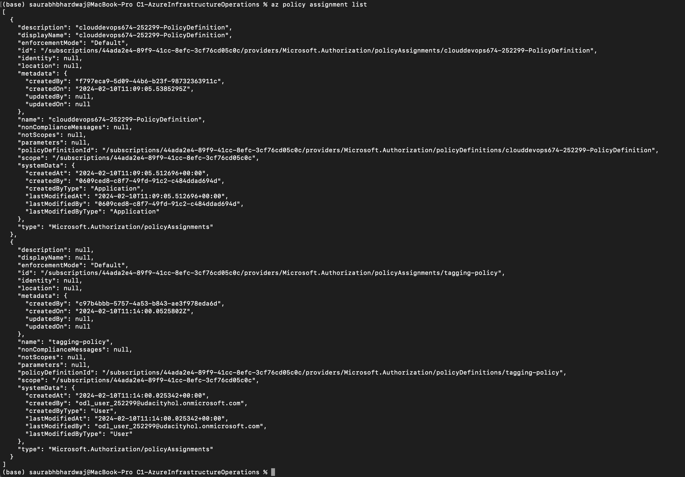

# Azure Infrastructure Operations Project: Deploying a scalable IaaS web server in Azure

## Introduction

This project includes the creation and deployment of a highly customizable and scalable IaaS web server on Microsoft Azure using HashiCorp Packer and Terraform. It is designed to allow users to quickly and efficiently deploy a web server environment by specifying their own configurations, such as the Azure subscription ID, client ID, and client secret. The scalability feature of the project enables users to define the required number of virtual machines (VMs) based on their needs, ensuring that the deployment can handle varying loads.

## Getting Started
To utilize this project for deploying your own scalable web server in Azure, follow these steps:

**Clone this Repository:** Start by cloning this repository to your local machine to get access to all necessary files for deployment.

**Create Your Infrastructure as Code:** Utilize the provided Packer and Terraform templates to define your infrastructure.

**Customize the Deployment:** Modify the provided templates with your specific Azure credentials and desired configurations.

## Dependencies
**Azure Account:** You'll need an active Azure account. If you don't have one, sign up for a free trial.
**Azure CLI:** Install the Azure Command Line Interface to interact with Azure resources.
**Packer:** Install Packer for creating the server images.
**Terraform:** Install Terraform for deploying the infrastructure.

## Instructions
### 1. Create Azure Credentials
Generate a service principal in Azure with the following command:
```
az ad sp create-for-rbac --query "{ client_id: appId, client_secret: password, tenant_id: tenant }"
```
Update the client_id, client_secret, and tenant_id in the webserver.json Packer template with the output from the above command.

### 2. Customizing and Scaling the Web Server

The num_of_vms variable in the variable.tf file is set to 2 by default. Adjust this number according to your requirements.

Customize other configurations such as packer_image_name, packer_resource_group, tags, resource_group, and location in the variable.tf file.

### 3. Enforcing Resource Tagging Policy

- Create the Azure policy definition to deny creation of untagged resources by running create_az_policy_definition.sh.
- Assign the policy using the Azure Portal.
- Verify policy assignment with az policy assignment list.

### 4. Create a Server Image with Packer
Create an image resource group using:
```
az group create --location northeurope --name PolicyRG
```
Fill in the required fields in the server.json Packer template.

Build the Packer image with packer build webserver.json.

Use az image list and az image delete to manage your images.

### 5. Deploy Infrastructure with Terraform

- Prepare main.tf and variable.tf with your desired infrastructure configuration.

- Initialize Terraform with terraform init.

- Review the deployment plan using terraform plan -out solution.plan.

- Apply the deployment with terraform apply "solution.plan".

### 6. Cleanup

Destroy all resources created by Terraform with terraform destroy.
Delete the Packer image with `az image delete -g PolicyRG -n <packer image name>`

## Output
After successfully applying the Terraform configuration, you should have a fully functional, scalable web server deployed in Azure. Below are screenshots demonstrating the outcomes:

Packer Image Creation: 

 

Terraform Apply Result: 

```
data.azurerm_image.web: Reading...
data.azurerm_image.web: Read complete after 1s [id=/subscriptions/44ada2e4-89f9-41cc-8efc-3cf76cd05c0c/resourceGroups/Azuredevops/providers/Microsoft.Compute/images/Packer-Server-Image]

Terraform used the selected providers to generate the following execution plan. Resource actions are indicated with the
following symbols:
  + create

Terraform will perform the following actions:

  # azurerm_availability_set.main will be created
  + resource "azurerm_availability_set" "main" {
      + id                           = (known after apply)
      + location                     = "westeurope"
      + managed                      = true
      + name                         = "udacity-assignment-aset"
      + platform_fault_domain_count  = 3
      + platform_update_domain_count = 5
      + resource_group_name          = "Azuredevops"
      + tags                         = {
          + "environment" = "development"
          + "project"     = "udacity1"
        }
    }

  # azurerm_lb.main will be created
  + resource "azurerm_lb" "main" {
      + id                   = (known after apply)
      + location             = "westeurope"
      + name                 = "udacity-assignment-lb"
      + private_ip_address   = (known after apply)
      + private_ip_addresses = (known after apply)
      + resource_group_name  = "Azuredevops"
      + sku                  = "Basic"
      + sku_tier             = "Regional"

      + frontend_ip_configuration {
          + gateway_load_balancer_frontend_ip_configuration_id = (known after apply)
          + id                                                 = (known after apply)
          + inbound_nat_rules                                  = (known after apply)
          + load_balancer_rules                                = (known after apply)
          + name                                               = "PublicIPAddress"
          + outbound_rules                                     = (known after apply)
          + private_ip_address                                 = (known after apply)
          + private_ip_address_allocation                      = (known after apply)
          + private_ip_address_version                         = (known after apply)
          + public_ip_address_id                               = (known after apply)
          + public_ip_prefix_id                                = (known after apply)
          + subnet_id                                          = (known after apply)
        }
    }

  # azurerm_lb_backend_address_pool.main will be created
  + resource "azurerm_lb_backend_address_pool" "main" {
      + backend_ip_configurations = (known after apply)
      + id                        = (known after apply)
      + inbound_nat_rules         = (known after apply)
      + load_balancing_rules      = (known after apply)
      + loadbalancer_id           = (known after apply)
      + name                      = "udacity-assignment-lb-backend-pool"
      + outbound_rules            = (known after apply)
    }

  # azurerm_linux_virtual_machine.main[0] will be created
  + resource "azurerm_linux_virtual_machine" "main" {
      + admin_password                                         = (sensitive value)
      + admin_username                                         = "odl_user_252299@udacityhol.onmicrosoft.com"
      + allow_extension_operations                             = true
      + availability_set_id                                    = (known after apply)
      + bypass_platform_safety_checks_on_user_schedule_enabled = false
      + computer_name                                          = (known after apply)
      + disable_password_authentication                        = false
      + extensions_time_budget                                 = "PT1H30M"
      + id                                                     = (known after apply)
      + location                                               = "westeurope"
      + max_bid_price                                          = -1
      + name                                                   = "udacity-assignment-vm-0"
      + network_interface_ids                                  = (known after apply)
      + patch_assessment_mode                                  = "ImageDefault"
      + patch_mode                                             = "ImageDefault"
      + platform_fault_domain                                  = -1
      + priority                                               = "Regular"
      + private_ip_address                                     = (known after apply)
      + private_ip_addresses                                   = (known after apply)
      + provision_vm_agent                                     = true
      + public_ip_address                                      = (known after apply)
      + public_ip_addresses                                    = (known after apply)
      + resource_group_name                                    = "Azuredevops"
      + size                                                   = "Standard_B1ls"
      + source_image_id                                        = "/subscriptions/44ada2e4-89f9-41cc-8efc-3cf76cd05c0c/resourceGroups/Azuredevops/providers/Microsoft.Compute/images/Packer-Server-Image"
      + tags                                                   = {
          + "environment" = "development"
          + "project"     = "udacity1"
        }
      + virtual_machine_id                                     = (known after apply)

      + os_disk {
          + caching                   = "ReadWrite"
          + disk_size_gb              = (known after apply)
          + name                      = (known after apply)
          + storage_account_type      = "Standard_LRS"
          + write_accelerator_enabled = false
        }
    }

  # azurerm_linux_virtual_machine.main[1] will be created
  + resource "azurerm_linux_virtual_machine" "main" {
      + admin_password                                         = (sensitive value)
      + admin_username                                         = "odl_user_252299@udacityhol.onmicrosoft.com"
      + allow_extension_operations                             = true
      + availability_set_id                                    = (known after apply)
      + bypass_platform_safety_checks_on_user_schedule_enabled = false
      + computer_name                                          = (known after apply)
      + disable_password_authentication                        = false
      + extensions_time_budget                                 = "PT1H30M"
      + id                                                     = (known after apply)
      + location                                               = "westeurope"
      + max_bid_price                                          = -1
      + name                                                   = "udacity-assignment-vm-1"
      + network_interface_ids                                  = (known after apply)
      + patch_assessment_mode                                  = "ImageDefault"
      + patch_mode                                             = "ImageDefault"
      + platform_fault_domain                                  = -1
      + priority                                               = "Regular"
      + private_ip_address                                     = (known after apply)
      + private_ip_addresses                                   = (known after apply)
      + provision_vm_agent                                     = true
      + public_ip_address                                      = (known after apply)
      + public_ip_addresses                                    = (known after apply)
      + resource_group_name                                    = "Azuredevops"
      + size                                                   = "Standard_B1ls"
      + source_image_id                                        = "/subscriptions/44ada2e4-89f9-41cc-8efc-3cf76cd05c0c/resourceGroups/Azuredevops/providers/Microsoft.Compute/images/Packer-Server-Image"
      + tags                                                   = {
          + "environment" = "development"
          + "project"     = "udacity1"
        }
      + virtual_machine_id                                     = (known after apply)

      + os_disk {
          + caching                   = "ReadWrite"
          + disk_size_gb              = (known after apply)
          + name                      = (known after apply)
          + storage_account_type      = "Standard_LRS"
          + write_accelerator_enabled = false
        }
    }

  # azurerm_linux_virtual_machine.main[2] will be created
  + resource "azurerm_linux_virtual_machine" "main" {
      + admin_password                                         = (sensitive value)
      + admin_username                                         = "odl_user_252299@udacityhol.onmicrosoft.com"
      + allow_extension_operations                             = true
      + availability_set_id                                    = (known after apply)
      + bypass_platform_safety_checks_on_user_schedule_enabled = false
      + computer_name                                          = (known after apply)
      + disable_password_authentication                        = false
      + extensions_time_budget                                 = "PT1H30M"
      + id                                                     = (known after apply)
      + location                                               = "westeurope"
      + max_bid_price                                          = -1
      + name                                                   = "udacity-assignment-vm-2"
      + network_interface_ids                                  = (known after apply)
      + patch_assessment_mode                                  = "ImageDefault"
      + patch_mode                                             = "ImageDefault"
      + platform_fault_domain                                  = -1
      + priority                                               = "Regular"
      + private_ip_address                                     = (known after apply)
      + private_ip_addresses                                   = (known after apply)
      + provision_vm_agent                                     = true
      + public_ip_address                                      = (known after apply)
      + public_ip_addresses                                    = (known after apply)
      + resource_group_name                                    = "Azuredevops"
      + size                                                   = "Standard_B1ls"
      + source_image_id                                        = "/subscriptions/44ada2e4-89f9-41cc-8efc-3cf76cd05c0c/resourceGroups/Azuredevops/providers/Microsoft.Compute/images/Packer-Server-Image"
      + tags                                                   = {
          + "environment" = "development"
          + "project"     = "udacity1"
        }
      + virtual_machine_id                                     = (known after apply)

      + os_disk {
          + caching                   = "ReadWrite"
          + disk_size_gb              = (known after apply)
          + name                      = (known after apply)
          + storage_account_type      = "Standard_LRS"
          + write_accelerator_enabled = false
        }
    }

  # azurerm_network_interface.main will be created
  + resource "azurerm_network_interface" "main" {
      + applied_dns_servers           = (known after apply)
      + dns_servers                   = (known after apply)
      + enable_accelerated_networking = false
      + enable_ip_forwarding          = false
      + id                            = (known after apply)
      + internal_dns_name_label       = (known after apply)
      + internal_domain_name_suffix   = (known after apply)
      + location                      = "westeurope"
      + mac_address                   = (known after apply)
      + name                          = "udacity-assignment-nic"
      + private_ip_address            = (known after apply)
      + private_ip_addresses          = (known after apply)
      + resource_group_name           = "Azuredevops"
      + tags                          = {
          + "environment" = "development"
          + "project"     = "udacity1"
        }
      + virtual_machine_id            = (known after apply)

      + ip_configuration {
          + gateway_load_balancer_frontend_ip_configuration_id = (known after apply)
          + name                                               = "internal"
          + primary                                            = (known after apply)
          + private_ip_address                                 = (known after apply)
          + private_ip_address_allocation                      = "Dynamic"
          + private_ip_address_version                         = "IPv4"
          + subnet_id                                          = (known after apply)
        }
    }

  # azurerm_network_interface_backend_address_pool_association.main will be created
  + resource "azurerm_network_interface_backend_address_pool_association" "main" {
      + backend_address_pool_id = (known after apply)
      + id                      = (known after apply)
      + ip_configuration_name   = "internal"
      + network_interface_id    = (known after apply)
    }

  # azurerm_network_security_group.main will be created
  + resource "azurerm_network_security_group" "main" {
      + id                  = (known after apply)
      + location            = "westeurope"
      + name                = "acceptanceTestSecurityGroup1"
      + resource_group_name = "Azuredevops"
      + security_rule       = (known after apply)
      + tags                = {
          + "environment" = "development"
          + "project"     = "udacity1"
        }
    }

  # azurerm_network_security_rule.rule1 will be created
  + resource "azurerm_network_security_rule" "rule1" {
      + access                      = "Deny"
      + description                 = "This rule with low priority deny all the inbound traffic."
      + destination_address_prefix  = "*"
      + destination_port_range      = "*"
      + direction                   = "Inbound"
      + id                          = (known after apply)
      + name                        = "DenyAllInbound"
      + network_security_group_name = "acceptanceTestSecurityGroup1"
      + priority                    = 100
      + protocol                    = "*"
      + resource_group_name         = "Azuredevops"
      + source_address_prefix       = "*"
      + source_port_range           = "*"
    }

  # azurerm_network_security_rule.rule2 will be created
  + resource "azurerm_network_security_rule" "rule2" {
      + access                      = "Allow"
      + description                 = "This rule allow the inbound traffic inside the same virtual network."
      + destination_address_prefix  = "VirtualNetwork"
      + destination_port_ranges     = [
          + "10.0.0.0/22",
        ]
      + direction                   = "Inbound"
      + id                          = (known after apply)
      + name                        = "AllowInboundInsideVN"
      + network_security_group_name = "acceptanceTestSecurityGroup1"
      + priority                    = 101
      + protocol                    = "*"
      + resource_group_name         = "Azuredevops"
      + source_address_prefix       = "VirtualNetwork"
      + source_port_ranges          = [
          + "10.0.0.0/22",
        ]
    }

  # azurerm_network_security_rule.rule3 will be created
  + resource "azurerm_network_security_rule" "rule3" {
      + access                      = "Allow"
      + description                 = "This rule allow the outbound traffic inside the same virtual network."
      + destination_address_prefix  = "VirtualNetwork"
      + destination_port_ranges     = [
          + "10.0.0.0/22",
        ]
      + direction                   = "Outbound"
      + id                          = (known after apply)
      + name                        = "AllowOutboundInsideVN"
      + network_security_group_name = "acceptanceTestSecurityGroup1"
      + priority                    = 102
      + protocol                    = "*"
      + resource_group_name         = "Azuredevops"
      + source_address_prefix       = "VirtualNetwork"
      + source_port_ranges          = [
          + "10.0.0.0/22",
        ]
    }

  # azurerm_network_security_rule.rule4 will be created
  + resource "azurerm_network_security_rule" "rule4" {
      + access                      = "Allow"
      + description                 = "This rule allow the HTTP traffic from the load balancer."
      + destination_address_prefix  = "VirtualNetwork"
      + destination_port_ranges     = [
          + "10.0.0.0/22",
        ]
      + direction                   = "Inbound"
      + id                          = (known after apply)
      + name                        = "AllowHTTPFromLB"
      + network_security_group_name = "acceptanceTestSecurityGroup1"
      + priority                    = 103
      + protocol                    = "Tcp"
      + resource_group_name         = "Azuredevops"
      + source_address_prefix       = "AzureLoadBalancer"
      + source_port_ranges          = [
          + "10.0.0.0/22",
        ]
    }

  # azurerm_public_ip.main will be created
  + resource "azurerm_public_ip" "main" {
      + allocation_method       = "Static"
      + ddos_protection_mode    = "VirtualNetworkInherited"
      + fqdn                    = (known after apply)
      + id                      = (known after apply)
      + idle_timeout_in_minutes = 4
      + ip_address              = (known after apply)
      + ip_version              = "IPv4"
      + location                = "westeurope"
      + name                    = "udacity-assignment-public-ip"
      + resource_group_name     = "Azuredevops"
      + sku                     = "Basic"
      + sku_tier                = "Regional"
      + tags                    = {
          + "environment" = "development"
          + "project"     = "udacity1"
        }
    }

  # azurerm_resource_group.main will be created
  + resource "azurerm_resource_group" "main" {
      + id       = (known after apply)
      + location = "westeurope"
      + name     = "Azuredevops"
    }

  # azurerm_subnet.internal will be created
  + resource "azurerm_subnet" "internal" {
      + address_prefixes                               = [
          + "10.0.2.0/24",
        ]
      + enforce_private_link_endpoint_network_policies = (known after apply)
      + enforce_private_link_service_network_policies  = (known after apply)
      + id                                             = (known after apply)
      + name                                           = "internal"
      + private_endpoint_network_policies_enabled      = (known after apply)
      + private_link_service_network_policies_enabled  = (known after apply)
      + resource_group_name                            = "Azuredevops"
      + virtual_network_name                           = "udacity-assignment-network"
    }

  # azurerm_virtual_network.main will be created
  + resource "azurerm_virtual_network" "main" {
      + address_space       = [
          + "10.0.0.0/22",
        ]
      + dns_servers         = (known after apply)
      + guid                = (known after apply)
      + id                  = (known after apply)
      + location            = "westeurope"
      + name                = "udacity-assignment-network"
      + resource_group_name = "Azuredevops"
      + subnet              = (known after apply)
      + tags                = {
          + "environment" = "development"
          + "project"     = "udacity1"
        }
    }

Plan: 17 to add, 0 to change, 0 to destroy.

──────────────────────────────────────────────────────────────────────────────────────────────────────────────────────────────

Saved the plan to: solution.plan

To perform exactly these actions, run the following command to apply:
    terraform apply "solution.plan"
```

